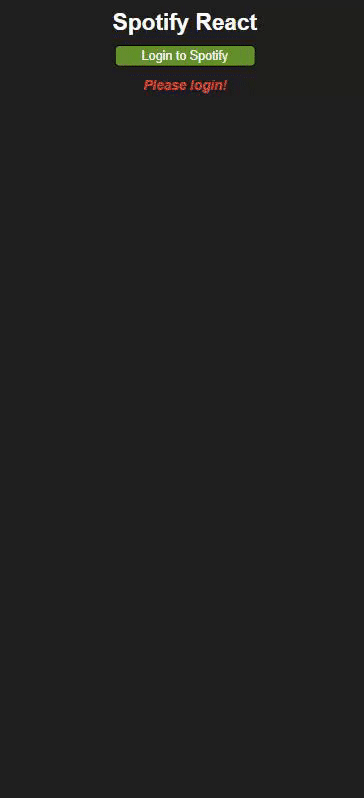

<h1 align="center">
  <a href="https://spotifree-demo.netlify.app">
    Spotifree
  </a>
</h1>

  

  

  
  

Spotifree is an application built with React and uses the Spotify API in order to retrieve artist data based on the users search query, and represent this in a visual layout.

It was designed to be simple, and mainly as an experiment in working with the Spotify API as-well as representing this data in a grid layout with responsive media queries.

  

## Installation
To install **Spotifree** you can either:
1.  Download the repository as a `ZIP` file, and unpack it into your local environment
2.  Clone the repo `git@github.com:FluroAsh/spotifree.git` with the Git CLI command in your terminal, ensuring that this is inside your local envrionment.